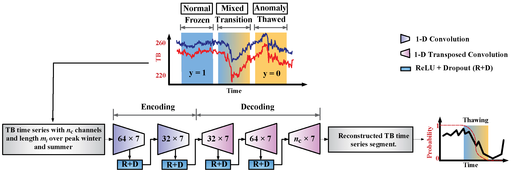
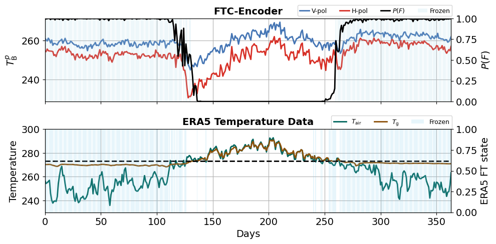

[](https://colab.research.google.com/github/aebtehaj/FTCEncoder/blob/main/Main.ipynb)

# **FTC-Encoder**
# An Autoencoder Architecture for L-band Passive Microwave Retrieval of Freeze-Thaw Cycle
By Divya Kumawat and Ardeshir Ebtehaj -- June 2024

## Introduction

This Jupyter Notebook presents the computational implementation of the *FTC-Encoder*: A convolutional autoencoder deep learning framework for probabilistic characterization of the ground freeze-thaw (FT) dynamics to enhance our understanding of permafrost response to global warming and shifts in the high-latitude carbon cycle, using Soil Moisture Active Passive (SMAP) satellite brightness temperatures (TB) observations at L-band. While the results are presented for SMAP data, the framework can be generalized to other low-frequency passive microwave observations with negligible atmospheric attenuation. 

The proposed method recasts the FT-cycle passive microwave retrieval as an anomaly detection problem in which the peak winter (summer) represents the normal (anomaly) segments of the TB time series. This approach relies on (i) a supervised convolutional autoencoder architecture that incorporates the temporal information of the TB time series; (ii) produces a probability measure representing the state of the surface FT cycle, and (iii) only needs labels for frozen (peak winter) and thawed (peak summer) segments of time series, which can be provided with minimum uncertainty and almost no reliance on sparse ground-based observations.




<p align="center"><em>A schematic representation of the FTC-Encoder architecture. Both polarization channels of SMAP TBs and their differences (i.e., polarization signal) are used as inputs. The encoder block captures a low-dimensional latent space representation through a series of 1D convolution layers followed by ReLU activation functions and a dropout layer with 10% rate. The decoder block upsamples the latent space through a series of 1D transposed convolution layers, the ReLU activation functions, and dropout layers. The filter size is one week but the number of filters varies from 32 to 64 through the encoder and decoder blocks.</em></p>


<a name="4"></a> <br>
## Code

<a name="41"></a> <br>
###   Setup

To run this notebook on Google Colab, clone this repository
```python
!git clone https://github.com/Divak14/FTCEncoder
cd FTCEncoder
```


```python
import random
import numpy as np
import tensorflow as tf
from tensorflow import keras
from sklearn.model_selection import train_test_split
import importlib
import warnings
warnings.filterwarnings('ignore', category=DeprecationWarning, module='tensorflow')

# Import classes and functions from utils_main
import utils_main
importlib.reload(utils_main)
from utils_main import DataPreprocessor, AutoencoderModel, contrastive_loss_function, train_model,  compute_train_val_accuracy, compute_accuracy, visualize_probability_time_series, Accuracy
tf.config.list_physical_devices('GPU')
```


<a name="42"></a> <br>
 ### Load the Data


The training data comprises segments with varying sizes of normalized TB time series at horizontal and vertical polarization and their differences, representing peak frozen and thawed seasons.


```python
# Load the training data

Data = np.load('Training_dataset.npz', allow_pickle=True)
Train_winter = Data['Train_winter'] # frozen time series with variable lengths
Train_summer = Data['Train_summer'] # thawed time series with variable lengths

print('The number of frozen time series is:')
print('--------------------------------')
print(Train_winter.shape)
print('The number of thawed time series is:')
print('--------------------------------')
print(Train_summer.shape)
i=random.randrange(Train_winter.shape[1])
print(f"The size of the {i}th traning data block in winter is:")
print('--------------------------------')
print(Train_winter[0,i].shape)
```

    The number of frozen time series is:
    --------------------------------
    (1, 9380)
    The number of thawed time series is:
    --------------------------------
    (1, 13397)
    The size of the 8876th traning data block in winter is:
    --------------------------------
    (3, 164)


**Preparing data to train the model over Savannas land cover type**


<div style="text-align: center;">
    
    <p><em>The study area overlaid with IGBP land-cover types, water-fraction classes, and the spatial distribution of 34 available International Soil Moisture Stations (ISMN) ground stations used in this study.</em></p>
</div>

<a name="43"></a> <br>
### Data Preprocessing for Training


```python
warnings.filterwarnings('ignore', category=DeprecationWarning)

# Initialize DataPreprocessor
preprocessor = DataPreprocessor()

# Collect and preprocess data
# 1- cropping and padding the data 
train_winter_pad, train_summer_pad = preprocessor.collect_data(Train_winter, Train_summer)
# 2- appending the labels to the training data and concatenating winter and summer data
print("number of sequences x lengths of padded sequences x number of channels + labels")
print("------------------------------------------------------------------------------")
combine_train_set, Xytrain = preprocessor.create_master_train_data(train_winter_pad, train_summer_pad)

```

    number of squences x lengths of padded sequences x number of channels + lables
    ------------------------------------------------------------------------------
    (22777, 292, 4)


 <a name="44"></a> <br>

 ###   Create FTC-Encoder Model


```python
# Model parameters
fs = 32                 # Specify the number of 1-D convolution filters 
ks = 8                  # Specify 1-D convolution filter size
dr = 0.1                # Specify the dropout rate

# Create and compile the autoencoder model
FTC_Encoder = AutoencoderModel(dropout_rate=dr, filter_size=fs, kernel_size=ks, l2_reg_rate=0.001)
model = FTC_Encoder.get_model()
model.compile(optimizer=keras.optimizers.Adam(learning_rate=0.001), loss=contrastive_loss_function, metrics = [Accuracy])
model.summary()

# Split data into training and testing sets
X_train, X_test, y_train, y_test = train_test_split(combine_train_set, Xytrain, test_size=0.2, random_state=1)
```

    WARNING:absl:At this time, the v2.11+ optimizer `tf.keras.optimizers.Adam` runs slowly on M1/M2 Macs, please use the legacy Keras optimizer instead, located at `tf.keras.optimizers.legacy.Adam`.


    Model: "autoencoder"
    _________________________________________________________________
     Layer (type)                Output Shape              Param #   
    =================================================================
     input_2 (InputLayer)        [(None, None, 3)]         0         
                                                                     
     masking_1 (Masking)         (None, None, 3)           0         
                                                                     
     conv1d_2 (Conv1D)           (None, None, 64)          1600      
                                                                     
     batch_normalization_4 (Bat  (None, None, 64)          256       
     chNormalization)                                                
                                                                     
     dropout_2 (Dropout)         (None, None, 64)          0         
                                                                     
     conv1d_3 (Conv1D)           (None, None, 32)          16416     
                                                                     
     batch_normalization_5 (Bat  (None, None, 32)          128       
     chNormalization)                                                
                                                                     
     conv1d_transpose_3 (Conv1D  (None, None, 32)          8224      
     Transpose)                                                      
                                                                     
     batch_normalization_6 (Bat  (None, None, 32)          128       
     chNormalization)                                                
                                                                     
     dropout_3 (Dropout)         (None, None, 32)          0         
                                                                     
     conv1d_transpose_4 (Conv1D  (None, None, 64)          16448     
     Transpose)                                                      
                                                                     
     batch_normalization_7 (Bat  (None, None, 64)          256       
     chNormalization)                                                
                                                                     
     conv1d_transpose_5 (Conv1D  (None, None, 3)           1539      
     Transpose)                                                      
                                                                     
    =================================================================
    Total params: 44995 (175.76 KB)
    Trainable params: 44611 (174.26 KB)
    Non-trainable params: 384 (1.50 KB)
    _________________________________________________________________


<a name="45"></a> <br>

### Training FTC-Encoder Model


```python
# Training the model
history = train_model(model, X_train, y_train, X_test, y_test, epochs = 10)
```


#### Evaluate the Trained Model on the Test Set


```python
training_accuracy, testing_accuracy = compute_train_val_accuracy(
    model, X_train, y_train, X_test, y_test
)
```

    570/570 [==============================] - 3s 5ms/step
    Training Accuracy: 99.18%
    143/143 [==============================] - 1s 5ms/step
    Testing Accuracy: 98.98%


<a name="46"></a> <br>

### FT Probability Computation with FTC-Encoder using SMAP TB Time Series


Load SMAP TB time series for 2018-2019 along with additional parameters including ground and air temperatures from ERA5.


```python
Data_SMAP = np.load('Testing_dataset_SMAP_ts.npz', allow_pickle=True)
normalized_ts = Data_SMAP['normalized_ts']
SMAP_ts = Data_SMAP['SMAP_ts']
var_ts = Data_SMAP['var_ts']
```


```python
# Compute the probability of FT state using FTC-Encoder
processed_test_data = preprocessor.process_test_data(normalized_ts)
reconstruction = model.predict(processed_test_data)
test_mae_loss_winter = np.sqrt(np.mean(np.square(reconstruction - processed_test_data), axis=2))
mse = np.mean(np.square(reconstruction - processed_test_data) , axis = 2)
prob = 1-np.exp(-mse)
```

    47/47 [==============================] - 0s 7ms/step


 ####   Plot the result


```python
n = 50  # The index of the data sample to be visualized (Max 1500)
visualize_probability_time_series(n, SMAP_ts, prob, var_ts, fs = 14, start_timeid=1, end_timeid=365)

```

    Accuracy: 96.70%


    

    


